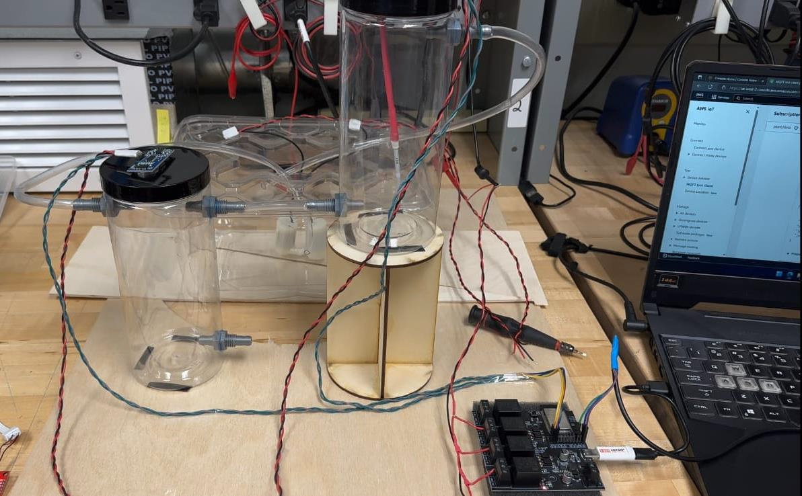
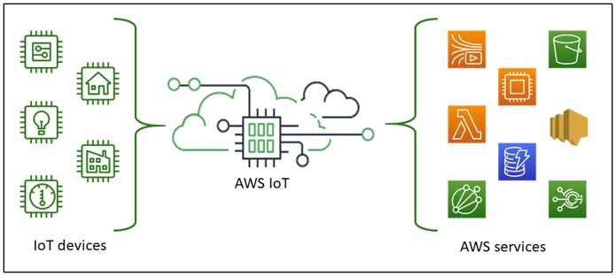
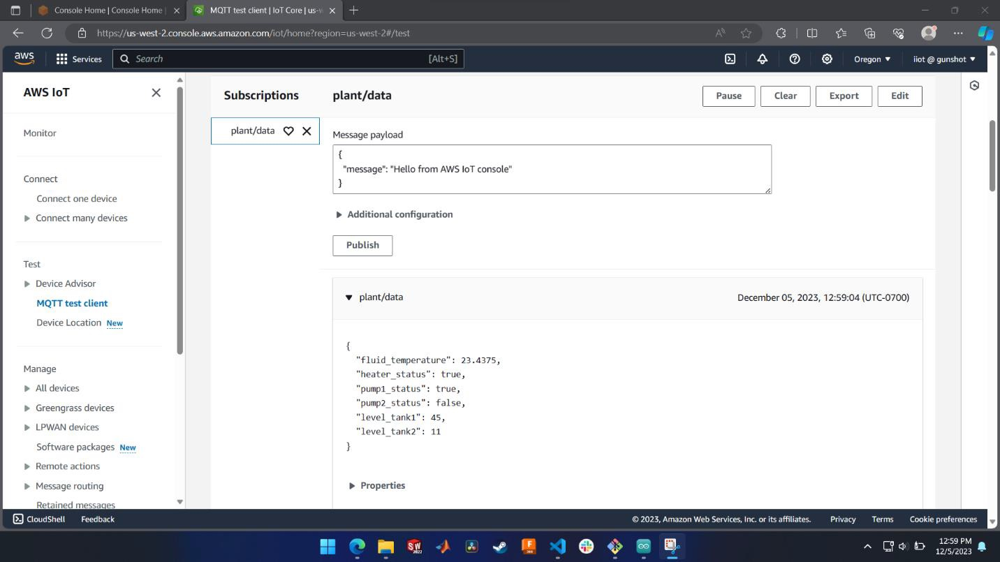
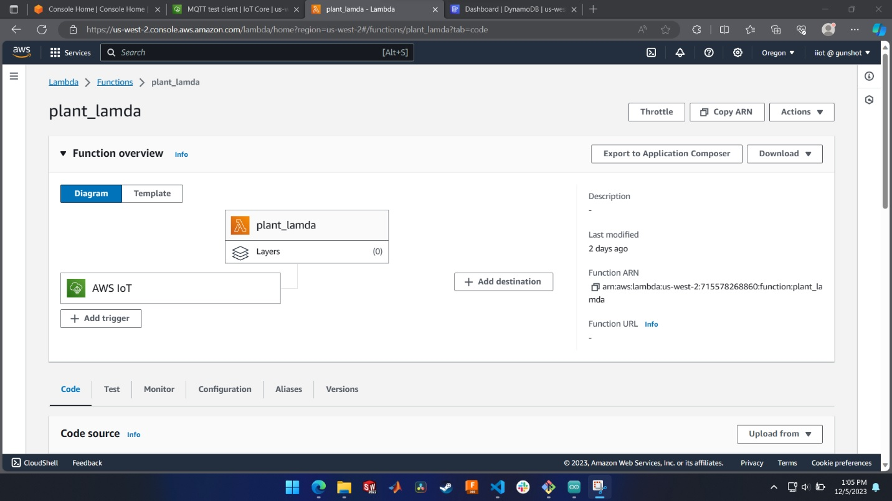
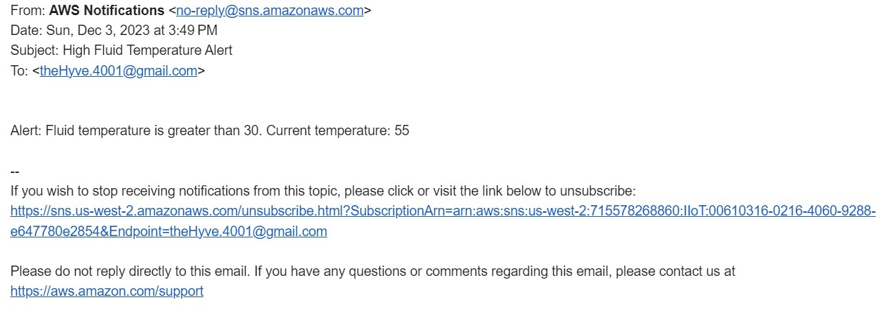
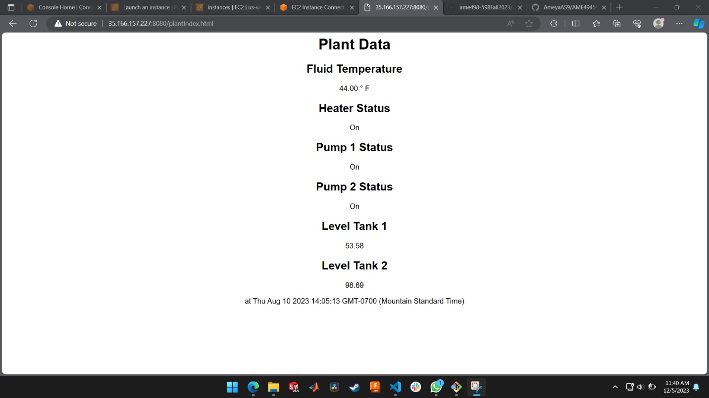

# IoT-Based Factory/ Plant Monitoring and Control System

- [Overview](#overview)
- [Key Features](#key-features)
- [Project Structure](#project-structure)
  - [Simulation/Software](#Simulation/Software)
  - [Hardware Plant Setup](#hardware-plant-setup)
- [Results](#results)
- [References](#references)
- [Project Report](Report/AME_598_Final_Project_Report.pdf)

## Overview

In industrial environments, the lack of real-time monitoring leads to inefficiencies and delays in addressing critical issues. This project introduces an IIoT-based system for proactive monitoring and control, enhancing operational efficiency.

- **Fig 1:** Plant setup
---

- **Fig 2:** AWS IoT Core System
---
## Key Features

- Continuous data collection from strategically placed sensors.
- Real-time monitoring for anomaly detection.
- Customizable alert thresholds for timely response.
- Integration with AWS services: Lambda, Timestream, DynamoDB, Grafana, and IoT Core.

## Project Structure
---
The proposed approach comprises installation of a strong industrial monitoring system that uses strategically placed sensors to collect real-time data in the industrial setting. These sensors function as data gathering nodes, securely transferring information to a centralized server suited for data management. To enable easy collation and retrieval, the server employs modern data handling techniques. Real-time data analysis is used to improve the systems’ capabilities by implementing complex algorithms aimed for anomaly identification and SNS for quick redressal in response to vital sensor data . Users can customize alert thresholds to tailor notifications based on specific characteristics, ensuring a prompt and targeted response to emergent situations. To give users a full insight, This proposed method includes developing of a demonstration kit, replicating a real-world industrial process plant, along with an IoT System pipeline and user-friendly dashboards. These dashboards will provide user friendly monitoring interfaces to analyze large data easily.

### Simulation/Software

In the development of an AWS IoT Core pipeline, a Python script was created to simulate sensor data, generating realistic information using libraries such as 'random'. The script establishes an MQTT connection to the AWS IoT Core endpoint, publishing simulated sensor data at regular intervals. AWS IoT policies and security credentials were configured to enable secure communication. Subsequently, an AWS IoT Rule was set up to trigger a Lambda function upon receiving the simulated data, allowing for further processing or integration with other AWS services. This comprehensive integration provides a foundation for scalable and real-time handling of sensor data within the AWS ecosystem.

### Hardware Plant Setup

A DIY approach was employed to develop a two-tank fluid system, involving the creation and soldering of electronic circuits, assembly of a piping system, 3D printing of components, and sensor integration. Electronic circuits included voltage regulators and controllers to monitor and control fluid levels. The piping system focused on secure connections and seamless fluid flow between tanks. 3D printing was utilized for manufacturing bulkheads and connectors, ensuring precise fitment for rapid deployment of this custom fluid system, from electrical component housing to connectors.

## Results

Successful implementation of algorithms and hardware configurations led to the active use of the demo kit.

- **Fig 3:** AWS IoT Core receiving real-time data
---

- **Fig 4:** AWS Lambda function receives and processes data for storage
---

- **Fig 5:** AWS Lambda function also sends mail alert notifications (SNS)
---

- **Fig 6:** Dashboard showing real-time data
---

## References

1. Detector model examples - AWS IOT events. (n.d.-a). https://docs.aws.amazon.com/iotevents/latest/developerguide/iotevents-examples.html  
2. Supported actions - AWS IOT events. (n.d.-b). https://docs.aws.amazon.com/iotevents/latest/developerguide/iotevents-supported-actions.html 
3. Tutorials - AWS IOT events. (n.d.-c). https://docs.aws.amazon.com/iotevents/latest/developerguide/iotevents-tutorials.html
4. AWS Lambda Documentation. (n.d.-d). https://docs.aws.amazon.com/lambda/?icmpid=docs_homepage_featuredsvcs
5. AWS DynamoDB Documentation. (n.d.-e). https://docs.aws.amazon.com/dynamodb/?icmpid=docs_homepage_featuredsvcs
6. AWS SNS Documentation. (n.d.-f). https://docs.aws.amazon.com/sns/
7. AWS EC2 Documentation. (n.d.-g). https://docs.aws.amazon.com/ec2/?icmpid=docs_homepage_featuredsvcs
8. AWS TimeStream Documentation. (n.d.-h). https://docs.aws.amazon.com/timestream/latest/developerguide/Grafana.html

## Acknowledgment
We appreciate the support from faculty members Tejaswi Linge Gowda and Assegid Kidane.
